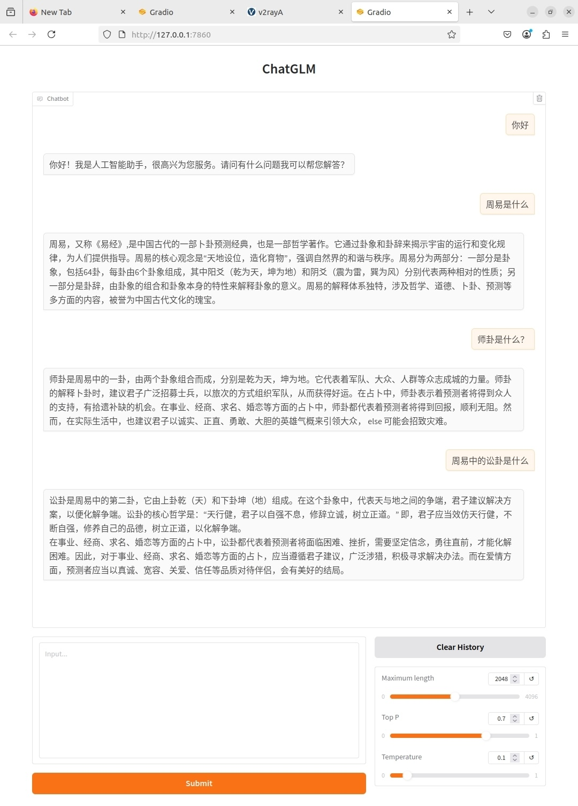

# 🔮 ChatGLM3-6B 周易问答 SFT + RAG 项目


- 本项目基于 [ChatGLM3-6B](https://github.com/THUDM/ChatGLM3) 模型的指令微调（SFT, Supervised Fine-Tuning）与RAG（Retrieval-Augmented Generation，检索增强生成）一体化实践，旨在探索中文场景下LLM的高效微调与知识增强方案。项目涵盖数据处理、模型微调、向量数据库构建、RAG推理与评测等完整流程
---

## 📁 项目结构
```angular2html
llm_NaiveFinetune/
├── config/                
├── data/                  
│   ├── gen_data4rag.py    
│   ├── questions_references4rag.json 
│   ├── raw/               
│   └── vec_db/            
├── data_gen/              
├── dataset_util/          
├── inference/             
│   ├── chatbot_demo.py    
│   └── chatbot_webui.py   
├── RAG/                   
│   ├── demo/              
│   ├── doc_process.py     
│   ├── judges.py          
│   ├── prompt_templates.py
│   └── RAG.py             
├── resources/             
├── train.py               
├── requirements.txt       
└── README.md              
```


## 🧠 模型简介：ChatGLM3-6B

ChatGLM3 是清华大学智谱 AI 发布的第三代中文大语言模型，支持中英双语、多轮对话，推理能力强，适合中文语境下的定制化微调任务。

---

## 📦 环境准备

建议配置如下：

- Python ≥ 3.9
- CUDA ≥ 11.7
- PyTorch ≥ 2.0
- Transformers ≥ 4.36
- [ChatGLM3 官方依赖](https://github.com/THUDM/ChatGLM3)

安装依赖：

```bash
pip install -r requirements.txt
```

## 📊 数据准备：周易问答数据集

数据格式采用 instruction-tuning 风格，每条样本为：

    [
      {
        "instruction": "请解释乾卦的含义。",
        "input": "",
        "output": "乾卦是《周易》六十四卦之首，象征天，代表刚健、自强不息。"
      },
      {
        "instruction": "卦象“风火家人”代表什么？",
        "input": "",
        "output": "风火家人卦象代表家庭伦理，强调内外有别、各司其职，是家庭和谐的象征。"
      }
    ]

## 🧪 模型微调（LoRA + PEFT）

本项目使用 Hugging Face 的 PEFT 工具库进行 LoRA 微调，适配大模型的低资源训练。

1. 配置文件：finetune_config.json

    {
      "model_name_or_path": "THUDM/chatglm3-6b",
      "output_dir": "output/zhouyi_lora",
      "train_file": "data/zhouyi.json",
      "per_device_train_batch_size": 2,
      "gradient_accumulation_steps": 4,
      "num_train_epochs": 3,
      "learning_rate": 5e-5,
      "fp16": true,
      "use_lora": true,
      "lora_rank": 8
    }

2. 启动微调

```bash
python train.py
```


## 前端交互：




# 🛒 RAG

本项目的RAG（Retrieval-Augmented Generation）部分位于 `RAG/` 目录，包含了实现检索增强生成的完整流程和相关工具，支持中文场景下的知识增强问答。

  ```bash
  python RAG/RAG.py
  ```

### 1. 主要功能

- **文档处理与分块**  
  通过 `doc_process.py` 对原始文档进行分块、清洗和预处理，适配向量化和检索需求。
- **向量化与向量数据库管理**  
  支持多种中文Embedding模型（如 bge-large-zh、text2vec-large-chinese），将文档分块向量化后存入 Chroma 等向量数据库，便于高效检索。
- **检索与融合生成**  
  `RAG.py` 实现了检索-生成一体化流程：  
  - 首先根据用户问题检索相关文档块  
  - 然后将检索结果与问题拼接，输入LLM进行生成  
  - 支持多种Prompt模板（见 `prompt_templates.py`），可灵活适配不同场景
- **评测与打分**  
  `judges.py` 提供了自动化评测工具，可对RAG生成结果进行准确性、相关性等多维度打分，支持批量评测和结果归档。

### 2. 目录结构

```
RAG/
├── doc_process.py         
├── judges.py              
├── prompt_templates.py    
├── RAG.py                 
└── vector_db/             
```

### 3. 特性亮点

- **多Embedding兼容**：支持主流中文Embedding模型，便于对比实验。
- **高效检索**：基于Chroma等高性能向量数据库，检索速度快、扩展性强。
- **灵活Prompt**：Prompt模板可自定义，适配多种RAG融合策略。
- **自动化评测**：内置评测工具，支持多维度打分与实验复现。


